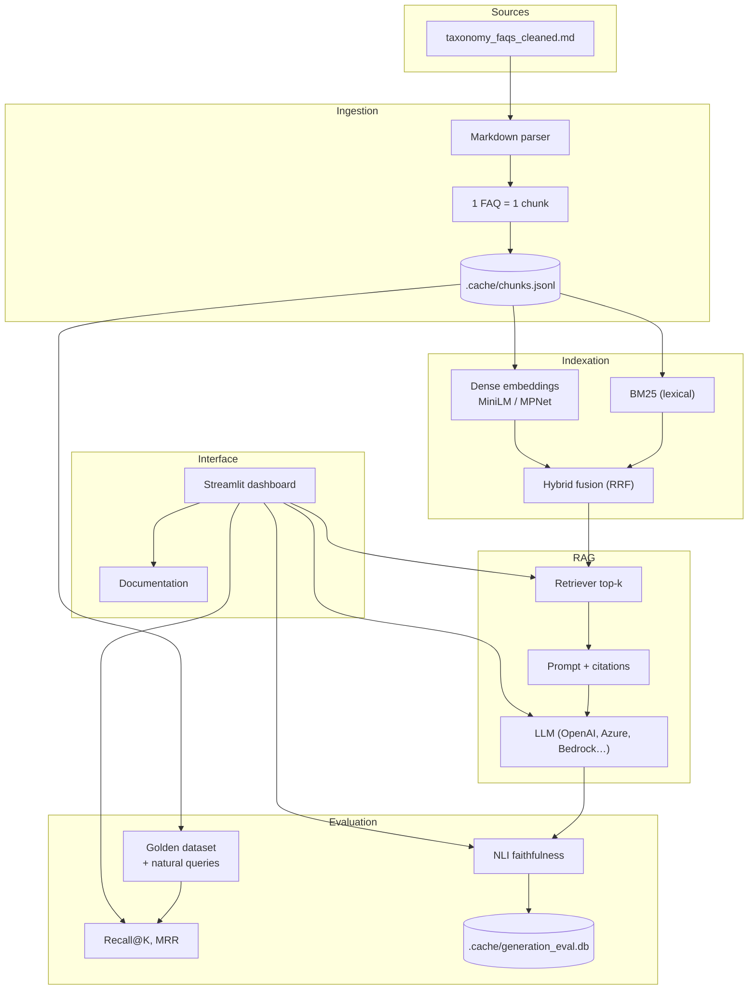

# EU Taxonomy RAG

Question-answering application built on a **RAG** (Retrieval-Augmented Generation) pipeline for the [official EU Taxonomy Navigator FAQs](https://ec.europa.eu/sustainable-finance-taxonomy/faq).

The goal is to provide **traceable, source-grounded answers**: each response relies only on retrieved FAQ chunks, with metrics to measure retrieval quality and the faithfulness of generated answers.

---

## Context

The EU Taxonomy is a European regulatory framework. The associated FAQs form a structured knowledge base (324 question–answer entries), where each unit is designed to be read independently.

This project provides an assistant that:

- answers **one isolated question at a time** (no conversational memory);
- limits scope to the provided FAQs (no external knowledge);
- enables **comparison and measurement** of different retrieval and generation approaches.

---

## Architecture



---

## Design principles

| Principle | Description |
|-----------|-------------|
| **1 FAQ = 1 chunk** | Each official entry stays an indivisible unit to avoid incomplete or mixed answers. |
| **Retrieval before generation** | Measure the ability to find the right chunks first, then evaluate answer faithfulness. |
| **Multi-method comparison** | BM25, dense search, and hybrid (RRF fusion) are benchmarked on the same datasets. |
| **Two evaluation datasets** | Reproducible golden dataset + “natural” queries (business personas) to test realism. |
| **Diagnostic groundedness** | Local NLI evaluation of generated claims, with persistence to track KPI trends over time. |
| **Self-contained deliverable** | Benchmark, interactive tests, and data exploration work **without an LLM API key**. |

---

## Features

| Streamlit page | Purpose |
|----------------|---------|
| **Home** | Welcome — project overview and quick access to features |
| **Chatbot** | Single-turn RAG Q&A + faithfulness evaluation |
| **Benchmark** | Retrieval evaluation (Recall@K, MRR), index build, JSON export |
| **Interactive test** | Side-by-side comparison of retrieval methods |
| **Data explorer** | Browse chunks and evaluation datasets |
| **Documentation** | Architecture choices, methodology, and metrics (guided walkthrough) |

---

## Prerequisites

- **Python 3.10, 3.11, or 3.12** (recommended: 3.11)
- **Git**
- Internet connection on first launch (downloads embedding models and, optionally, the NLI model)

No API key is required to get started. The Benchmark, Interactive test, Data explorer, and Documentation tabs work without an LLM.

---

## Local installation

### Windows (PowerShell)

```powershell
git clone <repo-url>
cd "RAG - Implementation"

py -3.11 -m venv .venv
.\.venv\Scripts\Activate.ps1
python -m pip install --upgrade pip
pip install -e ".[ui]"
eu-taxonomy-rag
```

### macOS / Linux

```bash
git clone <repo-url>
cd "RAG - Implementation"

python3.11 -m venv .venv
source .venv/bin/activate
python -m pip install --upgrade pip
pip install -e ".[ui]"
eu-taxonomy-rag
```

### One-liner (macOS / Linux)

```bash
chmod +x scripts/start.sh
./scripts/start.sh
```

---

## Docker installation

```bash
git clone <repo-url>
cd "RAG - Implementation"
docker compose up --build
```

Open [http://localhost:8501](http://localhost:8501).

Generated data is persisted on the local disk via bind mounts:

| Host path | Contents |
|-----------|----------|
| `./.cache` | FAQ chunks, BM25/dense indexes, SQLite `generation_eval.db` |
| `./data/evaluation/results` | Retrieval benchmark JSON exports |

Hugging Face models are cached in the named Docker volume `eu-taxonomy-rag_hf-cache`.

> **Important:** mount the volume on the `.cache` directory, not on the `generation_eval.db` file.

The Docker image uses **CPU-only PyTorch** (no NVIDIA CUDA packages). Aligns with `EU_TAXONOMY_EMBEDDING_DEVICE=cpu` in `docker-compose.yml`.

---

## First launch

1. Build **chunks** from `data/taxonomy_faqs_cleaned.md` → `.cache/chunks.jsonl`
2. Initialize the evaluation SQLite database → `.cache/generation_eval.db`
3. Open the Streamlit dashboard

Then: **Benchmark** tab → **Build indexes** (BM25 + dense). This step downloads embedding models; subsequent runs reuse the cache.

```bash
eu-taxonomy-rag --bootstrap-only      # prepare chunks without opening the UI
eu-taxonomy-rag --force-rebuild       # rebuild chunks from source
```

---

## LLM keys (Chatbot tab, optional)

For the **Chatbot** tab:

1. Enter credentials in the UI → **Save credentials to .env**
2. Or create a `.env` file at the project root (e.g. `OPENAI_API_KEY=...`)

Supported providers: OpenAI, Azure OpenAI, AWS Bedrock, OpenAI-compatible API.

---

## Evaluation

### Retrieval

Metrics: **Recall@1**, **Recall@3**, **Recall@5**, **MRR**.

Two datasets:

- `retrieval_golden_dataset_cleaned.jsonl` — reproducible benchmark (paraphrases + multi-chunk questions)
- `natural_user_queries_748.jsonl` — queries rewritten with business personas (sustainability officer, finance, etc.)

Results can be exported as JSON from the Benchmark tab.

### Generation (faithfulness / groundedness)

After each LLM response:

1. Split into short claims
2. NLI verification against retrieved chunks (`typeform/distilbert-base-uncased-mnli`)
3. Labels: `supported`, `contradicted`, `not_enough_info`
4. SQLite persistence for tracking over time (Chatbot **History** and **Metrics** tabs)

| Metric | Meaning |
|--------|---------|
| **Faithfulness** | `supported_claims / total_claims` |
| **Contradiction rate** | Share of contradicted claims |
| **Unsupported rate** | Share with insufficient information |

A **diagnostic** tool, not a perfect automatic judge. Disable with `ENABLE_GENERATION_EVAL=false`.

---

## Tech stack

| Component | Technology |
|-----------|------------|
| Language | Python 3.10–3.12 |
| Embeddings | sentence-transformers (MiniLM, MPNet) |
| Lexical | BM25 (`bm25s`) |
| Dense index | NumPy (default) or FAISS (optional) |
| LLM | OpenAI SDK (multi-provider) |
| Faithfulness | Transformers NLI (DistilBERT-MNLI) |
| UI | Streamlit |
| Persistence | JSONL cache, SQLite, JSON exports |
| Containerization | Docker + docker-compose |

---

## Project structure

```
app/
  streamlit_app.py        # main dashboard
  chatbot_page.py         # RAG chatbot
  documentation_page.py   # in-app documentation
  generation_eval_ui.py   # faithfulness UI
src/eu_taxonomy_rag/
  cli.py                  # bootstrap + Streamlit launch
  core/                   # parser, chunker, prompt
  retrieval/              # BM25, dense, hybrid, retriever
  pipelines/              # ingestion, RAG, index manager
  evaluation/             # benchmarks, metrics, NLI
  storage/                # SQLite persistence
data/
  taxonomy_faqs_cleaned.md
  evaluation/             # golden and natural query datasets
docs/                     # detailed documentation (chunking, datasets)
  documentation/          # sections shown in the Documentation tab
.cache/                   # chunks, indexes, evaluation DB (generated)
```

---

## Development

```bash
pip install -e ".[ui,dev]"
pytest
eu-taxonomy-rag --bootstrap-only
```

Optional extras: `faiss` (FAISS dense index), `dev` (pytest).

---

## Known limitations & possible improvements

| Current limitation | Possible improvement |
|------------------|----------------------|
| Closed corpus (324 FAQs) | Multi-source ingestion, incremental updates |
| Single-turn (no memory) | Conversational history with context window |
| No cross-encoder reranking | Reranker after hybrid fusion |
| Local index (NumPy/FAISS) | Managed vector DB (pgvector, OpenSearch…) |
| Lightweight NLI on CPU | RAGAS / end-to-end eval, more robust models |
| No distributed observability | Tracing (Langfuse, OpenTelemetry) |

---

## Additional documentation

- **In-app**: **Documentation** tab in the Streamlit dashboard (files in `docs/documentation/`)
- **Repository**: `docs/chunking.md`, `docs/golden_dataset.md`, `docs/natural_dataset.md`

---

## Troubleshooting

| Issue | Suggested fix |
|-------|---------------|
| `unable to open database file` | Write permissions on `.cache`; in Docker, mount a volume on `.cache` |
| FAQ not found in Docker | `EU_TAXONOMY_PROJECT_ROOT=/app` |
| `sentence-transformers` / torch | Python 3.10–3.12; avoid 3.13+ |
| Port 8501 in use | Change the port mapping in `docker-compose.yml` |

---

## License

See [LICENSE](LICENSE).
