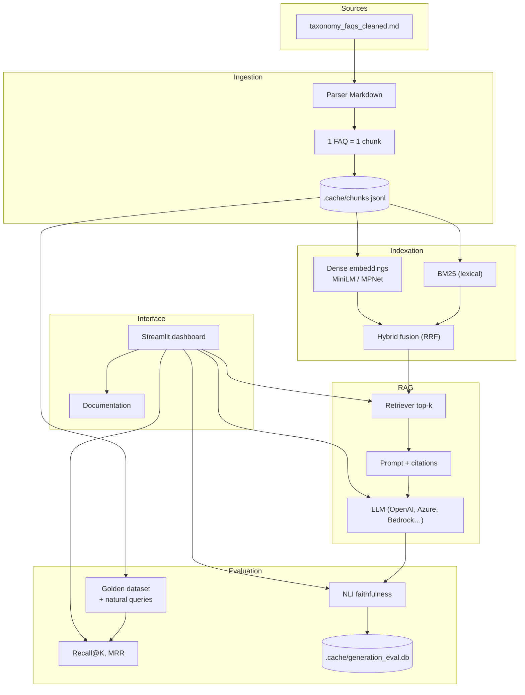

# EU Taxonomy RAG

Application de question-réponse basée sur un pipeline **RAG** (Retrieval-Augmented Generation) pour les [FAQ officielles de l'EU Taxonomy Navigator](https://ec.europa.eu/sustainable-finance-taxonomy/faq).

L'objectif est de fournir des réponses **traçables et ancrées dans la source** : chaque réponse s'appuie uniquement sur les chunks FAQ récupérés, avec des métriques pour mesurer la qualité du retrieval et la fidélité des réponses générées.

---

## Contexte

L'EU Taxonomy est un cadre réglementaire européen. Les FAQ associées constituent une base de connaissance structurée (324 entrées question-réponse) où chaque unité est conçue pour être lue indépendamment.

Ce projet propose un assistant qui :

- répond à **une question isolée à la fois** (pas de mémoire conversationnelle) ;
- limite le scope aux FAQ fournies (pas de connaissance externe) ;
- permet de **comparer et mesurer** différentes approches de retrieval et de génération.

---

## Architecture



---

## Principes de conception

| Principe | Description |
|----------|-------------|
| **1 FAQ = 1 chunk** | Chaque entrée officielle reste une unité indivisible pour éviter des réponses incomplètes ou mélangées. |
| **Retrieval avant génération** | On mesure d'abord la capacité à retrouver les bons chunks, puis on évalue la fidélité des réponses. |
| **Comparaison multi-méthodes** | BM25, recherche dense et hybride (fusion RRF) sont benchmarkées sur les mêmes jeux de données. |
| **Deux jeux d'évaluation** | Golden dataset reproductible + requêtes « naturelles » (personas métier) pour tester le réalisme. |
| **Groundedness diagnostique** | Évaluation NLI locale des affirmations générées, avec persistance pour suivre l'évolution des KPI. |
| **Livrable autonome** | Benchmark, tests interactifs et exploration des données fonctionnent **sans clé API LLM**. |

---

## Fonctionnalités

| Page Streamlit | Rôle |
|----------------|------|
| **Home** | Accueil — présentation du projet et accès rapide aux fonctionnalités |
| **Chatbot** | Q&R RAG single-turn + évaluation de faithfulness |
| **Benchmark** | Évaluation retrieval (Recall@K, MRR), build d'index, export JSON |
| **Interactive test** | Comparaison côte à côte des méthodes de retrieval |
| **Data explorer** | Exploration des chunks et jeux d'évaluation |
| **Documentation** | Choix d'architecture, méthodologie et métriques (parcours guidé) |

---

## Prérequis

- **Python 3.10, 3.11 ou 3.12** (recommandé : 3.11)
- **Git**
- Connexion internet au premier lancement (téléchargement des modèles d'embedding et, optionnellement, du modèle NLI)

Aucune clé API n'est requise pour démarrer. Les onglets Benchmark, Interactive test, Data explorer et Documentation fonctionnent sans LLM.

---

## Installation locale

### Windows (PowerShell)

```powershell
git clone <url-du-repo>
cd "RAG - Implementation"

py -3.11 -m venv .venv
.\.venv\Scripts\Activate.ps1
python -m pip install --upgrade pip
pip install -e ".[ui]"
eu-taxonomy-rag
```

### macOS / Linux

```bash
git clone <url-du-repo>
cd "RAG - Implementation"

python3.11 -m venv .venv
source .venv/bin/activate
python -m pip install --upgrade pip
pip install -e ".[ui]"
eu-taxonomy-rag
```

### Une seule commande (macOS / Linux)

```bash
chmod +x scripts/start.sh
./scripts/start.sh
```

---

## Installation Docker

```bash
git clone <url-du-repo>
cd "RAG - Implementation"
docker compose up --build
```

Ouvrez [http://localhost:8501](http://localhost:8501).

Les données générées sont persistées sur le disque local via des volumes bind :

| Chemin hôte | Contenu |
|-------------|---------|
| `./.cache` | Chunks FAQ, index BM25/dense, base SQLite `generation_eval.db` |
| `./data/evaluation/results` | Exports JSON des benchmarks retrieval |

Les modèles Hugging Face sont mis en cache dans le volume Docker nommé `eu-taxonomy-rag_hf-cache`.

> **Important :** montez le volume sur le répertoire `.cache`, pas sur le fichier `generation_eval.db`.

---

## Premier lancement

1. Construction des **chunks** depuis `data/taxonomy_faqs_cleaned.md` → `.cache/chunks.jsonl`
2. Initialisation de la base SQLite d'évaluation → `.cache/generation_eval.db`
3. Ouverture du tableau de bord Streamlit

Ensuite : onglet **Benchmark** → **Build indexes** (BM25 + dense). Cette étape télécharge les modèles d'embedding ; les lancements suivants réutilisent le cache.

```bash
eu-taxonomy-rag --bootstrap-only      # prépare les chunks sans ouvrir l'UI
eu-taxonomy-rag --force-rebuild       # reconstruit les chunks depuis la source
```

---

## Clés LLM (onglet Chatbot, optionnel)

Pour l'onglet **Chatbot** :

1. Saisir les identifiants dans l'interface → **Save credentials to .env**
2. Ou créer un fichier `.env` à la racine (ex. `OPENAI_API_KEY=...`)

Providers supportés : OpenAI, Azure OpenAI, AWS Bedrock, API compatible OpenAI.

---

## Évaluation

### Retrieval

Métriques : **Recall@1**, **Recall@3**, **Recall@5**, **MRR**.

Deux jeux de données :

- `retrieval_golden_dataset_cleaned.jsonl` — benchmark reproductible (paraphrases + questions multi-chunks)
- `natural_user_queries_748.jsonl` — requêtes réécrites avec personas métier (sustainability officer, finance, etc.)

Résultats exportables en JSON depuis l'onglet Benchmark.

### Génération (faithfulness / groundedness)

Après chaque réponse LLM :

1. Découpage en affirmations courtes
2. Vérification NLI contre les chunks récupérés (`typeform/distilbert-base-uncased-mnli`)
3. Étiquetage : `supported`, `contradicted`, `not_enough_info`
4. Persistance SQLite pour suivi dans le temps (onglets **History** et **Metrics** du Chatbot)

| Métrique | Signification |
|----------|---------------|
| **Faithfulness** | `supported_claims / total_claims` |
| **Contradiction rate** | Part des affirmations contredites |
| **Unsupported rate** | Part sans information suffisante |

Outil de **diagnostic**, pas un juge automatique parfait. Désactivable via `ENABLE_GENERATION_EVAL=false`.

---

## Stack technique

| Composant | Technologie |
|-----------|-------------|
| Langage | Python 3.10–3.12 |
| Embeddings | sentence-transformers (MiniLM, MPNet) |
| Lexical | BM25 (`bm25s`) |
| Index dense | NumPy (défaut) ou FAISS (optionnel) |
| LLM | OpenAI SDK (multi-provider) |
| Faithfulness | Transformers NLI (DistilBERT-MNLI) |
| UI | Streamlit |
| Persistance | JSONL cache, SQLite, exports JSON |
| Conteneurisation | Docker + docker-compose |

---

## Arborescence

```
app/
  streamlit_app.py        # tableau de bord principal
  chatbot_page.py         # chatbot RAG
  documentation_page.py   # documentation in-app
  generation_eval_ui.py   # UI faithfulness
src/eu_taxonomy_rag/
  cli.py                  # bootstrap + lancement Streamlit
  core/                   # parser, chunker, prompt
  retrieval/              # BM25, dense, hybrid, retriever
  pipelines/              # ingestion, RAG, index manager
  evaluation/             # benchmarks, métriques, NLI
  storage/                # persistance SQLite
data/
  taxonomy_faqs_cleaned.md
  evaluation/             # jeux golden et natural queries
docs/                     # documentation détaillée (chunking, datasets)
  documentation/          # sections affichées dans l'onglet Documentation
.cache/                   # chunks, index, base d'évaluation (généré)
```

---

## Développement

```bash
pip install -e ".[ui,dev]"
pytest
eu-taxonomy-rag --bootstrap-only
```

Extras optionnels : `faiss` (index dense FAISS), `dev` (pytest).

---

## Limites connues & évolutions possibles

| Limite actuelle | Évolution possible |
|-----------------|-------------------|
| Corpus fermé (324 FAQs) | Ingestion multi-sources, mise à jour incrémentale |
| Single-turn (pas de mémoire) | Historique conversationnel avec fenêtre de contexte |
| Pas de reranking cross-encoder | Reranker après fusion hybride |
| Index local (NumPy/FAISS) | Vector DB managée (pgvector, OpenSearch…) |
| NLI léger sur CPU | RAGAS / éval end-to-end, modèles plus robustes |
| Pas d'observabilité distribuée | Tracing (Langfuse, OpenTelemetry) |

---

## Documentation complémentaire

- **In-app** : onglet **Documentation** du tableau de bord Streamlit (fichiers dans `docs/documentation/`)
- **Dépôt** : `docs/chunking.md`, `docs/golden_dataset.md`, `docs/natural_dataset.md`

---

## Dépannage

| Problème | Piste de résolution |
|----------|---------------------|
| `unable to open database file` | Droits d'écriture sur `.cache` ; en Docker, monter un volume sur `.cache` |
| FAQ introuvable en Docker | `EU_TAXONOMY_PROJECT_ROOT=/app` |
| `sentence-transformers` / torch | Python 3.10–3.12 ; éviter 3.13+ |
| Port 8501 occupé | Changer le mapping port dans `docker-compose.yml` |

---

## Licence

Voir [LICENSE](LICENSE).
